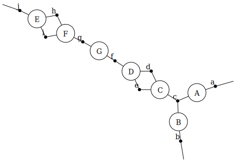
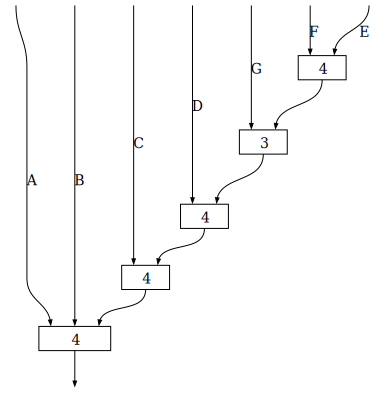

# NestedUWDs.jl
NestedUWDs.jl is a library for factorizing undirected wiring diagrams. The following example is taken from Spivak, Dobson, Kumari, and Wu, *Pixel Arrays*.

```julia
using Catlab
using NestedUWDs

diagram = @relation (a, b, j) begin
    A(a, c)
    B(b, c)
    C(c, d, e)
    D(d, e, f)
    G(f, g)
    F(g, h, i)
    E(h, i, j)
end

nuwd = NestedUWD(diagram)

to_graphviz(diagram; box_labels=:name, junction_labels=:variable)
```




```julia
to_graphviz(makeschedule(nuwd); labels=true)
```



The constructor `NestedUWD` factorizes an undirected wiring diagram as a nested collection of undirected wiring diagrams. The function `makeschedule` represents the nesting structure of the collection as a directed wiring diagram. The function `evalschedule` evaluates the collection.

```julia
using CategoricalTensorNetworks

a = 2
b = 2
j = 2
c = d = e = f = g = h = i = 10

generators = Dict{Symbol, Array{Float64}}(
    :A => randn((a, c)),
    :B => randn((b, c)),
    :C => randn((c, d, e)),
    :D => randn((d, e, f)),
    :G => randn((f, g)),
    :F => randn((g, h, i)),
    :E => randn((h, i, j)))

evalschedule(nuwd, generators)
```
